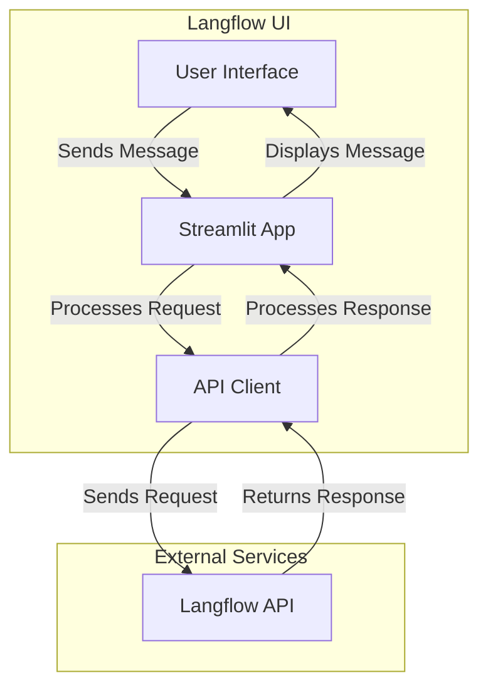

# Langflow Chat UI

<p align="center">
  
  
  
</p>

A modern, responsive Streamlit-based user interface for interacting with Langflow's API, featuring session management and a clean chat interface.

## 🚀 Features

- 💬 Interactive chat interface for Langflow API
- 🔄 Session-based chat history
- 🎨 Clean, responsive UI with dark/light theme support
- ⚙️ Configurable API endpoint
- 📦 Easy setup with pip
- 🔍 Debug mode for development
- 📱 Mobile-responsive design

## 📋 Prerequisites

- Python 3.8 or higher
- pip (Python package manager)
- Langflow server running (default: http://127.0.0.1:7860)

## 🛠️ Installation

1. **Clone the repository**:
   ```bash
   git clone https://github.com/shiragannavar/langflow-ui-streamlit.git
   cd langflow-ui-streamlit
   ```

2. **Create and activate a virtual environment**:
   ```bash
   # Windows
   python -m venv venv
   .\venv\Scripts\activate
   
   # macOS/Linux
   python3 -m venv venv
   source venv/bin/activate
   ```

3. **Install dependencies**:
   ```bash
   pip install -r requirements.txt
   ```

## 🚀 Running the Application

1. **Start the Streamlit app**:
   ```bash
   streamlit run run.py
   ```
   The application will automatically open in your default web browser at `http://localhost:8501`.

2. **Configuration**:
   - Create a `.env` file in the project root to override default settings:
     ```env
     LANGFLOW_API_URL=http://your-langflow-server:port/api/v1/run/your-flow-id
     ```

## 🏗️ Architecture



## 🧩 Project Structure

```
langflow-ui/
├── app/
│   ├── __init__.py         # Package initialization
│   ├── main.py             # Main Streamlit application
│   ├── api_client.py       # Langflow API client
│   └── config.py           # Configuration settings
├── .env.example           # Example environment variables
├── .gitignore             # Git ignore file
├── requirements.txt       # Python dependencies
└── run.py                 # Application entry point
```

## 🎯 Usage

1. **Starting a Session**:
   - Enter a unique Session ID in the sidebar
   - This helps maintain chat history for different conversations

2. **Chatting**:
   - Type your message in the input box at the bottom
   - Press Enter or click the send button
   - View responses in the chat window

3. **Session Management**:
   - Change the Session ID to start a new conversation
   - Use the "Clear Chat" button to reset the current conversation

## 🔧 Development

1. **Running in Development Mode**:
   ```bash
   streamlit run run.py --server.port=8501 --server.headless=true --server.fileWatcherType=none
   ```

2. **Running Tests**:
   ```bash
   # Install test requirements
   pip install -r requirements-dev.txt
   
   # Run tests
   pytest
   ```

## 🤝 Contributing

Contributions are welcome! Please follow these steps:

1. Fork the repository
2. Create a feature branch (`git checkout -b feature/AmazingFeature`)
3. Commit your changes (`git commit -m 'Add some AmazingFeature'`)
4. Push to the branch (`git push origin feature/AmazingFeature`)
5. Open a Pull Request

## 📄 License

This project is licensed under the MIT License - see the [LICENSE](LICENSE) file for details.

## 🙏 Acknowledgments

- [Streamlit](https://streamlit.io/) for the amazing UI framework
- [Langflow](https://github.com/langflow-ai/langflow) for the powerful LLM orchestration
- All contributors who have helped improve this project
